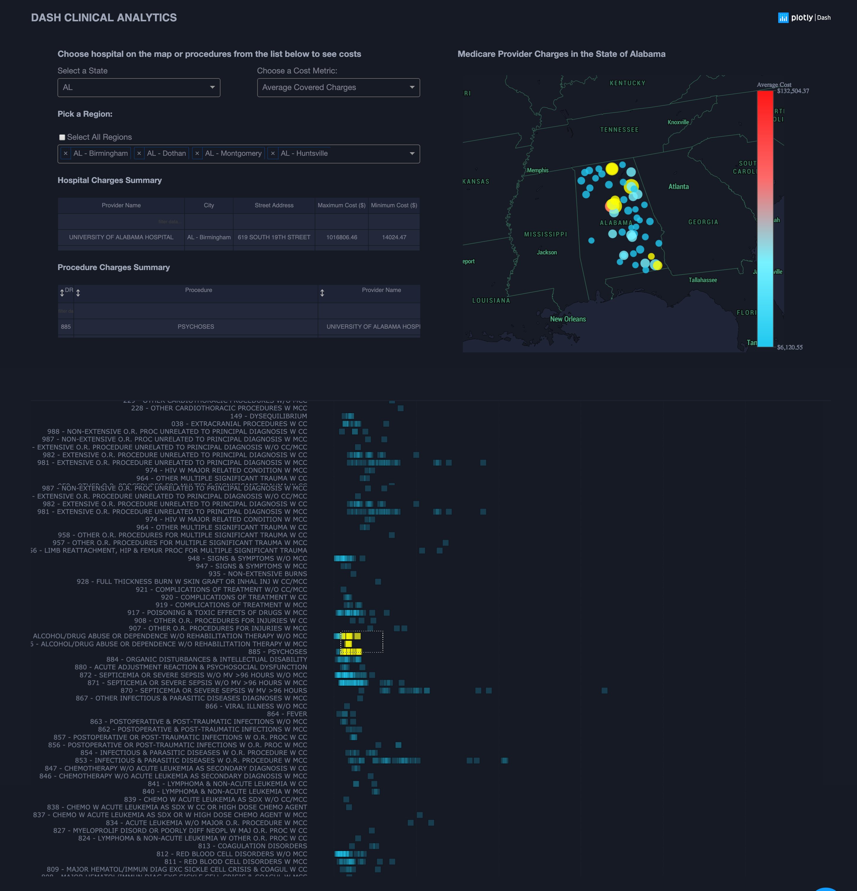

# library-sync

Link to published [page](https://library-usage.github.io/library-sync/)

Link to [api](https://libraries.io/api)

run `docker-compose up --build`
and open [http://0.0.0.0:8050](http://0.0.0.0:8050/)
in local browser

## Screenshot

## Resources
* [Dash](https://dash.plot.ly/)
* Inspired by [tableau template](https://www.tableau.com/solutions/workbook/improve-patient-satisfaction-improving-cycle-time)